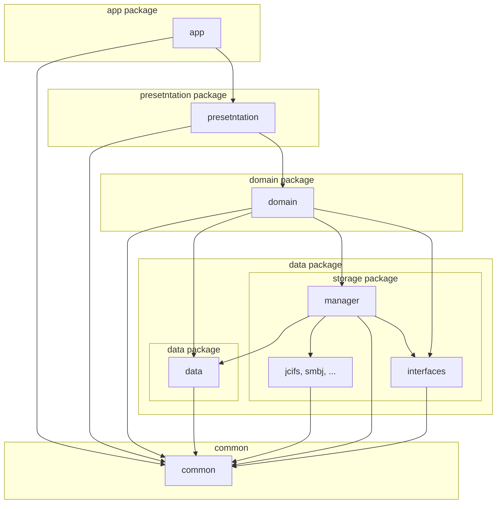

CIFS Documents Provider
=======================

## About

**CIFS Documents Provider** is an Android app to provide access to shared online storage.

 

## Download

### Google Play

### F-Droid

### Amazon Appstore

### Github

## Release History (APK Download)

* [Release](https://github.com/wa2c/cifs-documents-provider/releases)

## Source Code

* [GitHub](https://github.com/wa2c/cifs-documents-provider)

## Module Structure

## Guide

* [Wiki](https://github.com/wa2c/cifs-documents-provider/wiki)

## Translation

If you need a translation into your language, please add the translation data on the next page.

* [CIFS Documents Provider Translation Sheet](https://docs.google.com/spreadsheets/d/1y71DyM31liwjcAUuPIk3CuIqxJD2l9Y2Q-YZ0I0XE_E/edit?gid=0#gid=0)

## Licence

Copyright &copy; 2020 wa2c [MIT License](https://github.com/wa2c/cifs-documents-provider/blob/main/LICENSE)

## Author

[wa2c](https://github.com/wa2c)
