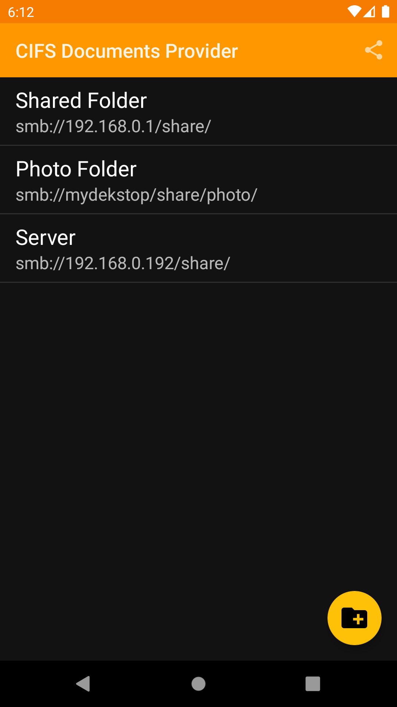
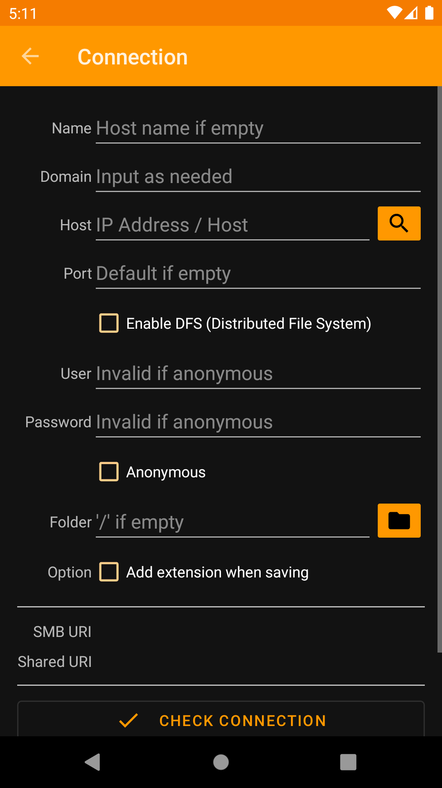
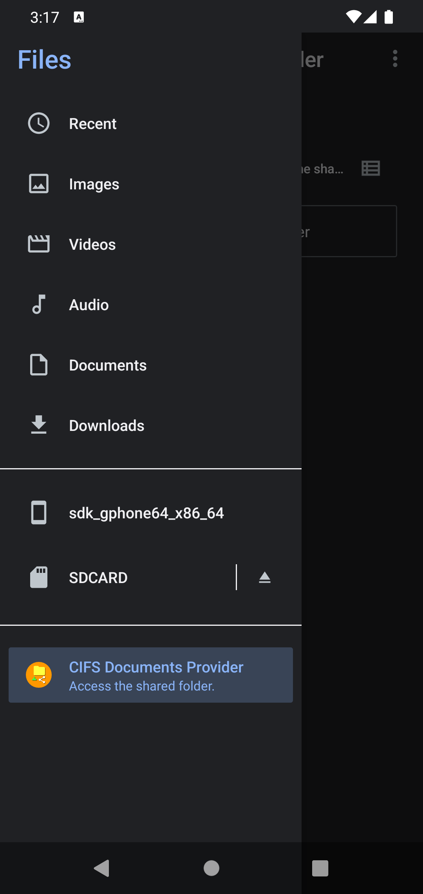
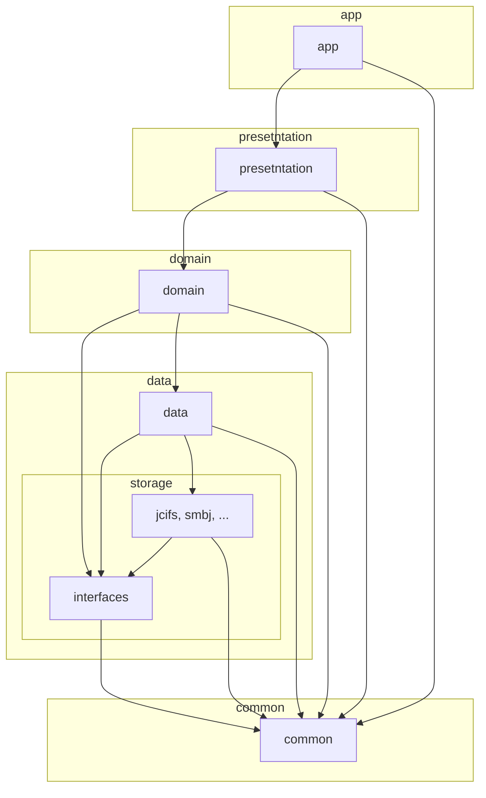

CIFS Documents Provider
=======================

## About

**CIFS Documents Provider** is an Android app to provide access to shared online storage.

 

## App Store

* [Google Play](https://play.google.com/store/apps/details?id=com.wa2c.android.cifsdocumentsprovider)
* [F-Droid](https://f-droid.org/packages/com.wa2c.android.cifsdocumentsprovider/)
* [Amazon Appstore](https://www.amazon.com/gp/product/B09D4264PB) 

## Release History (APK Download)

* [Release](https://github.com/wa2c/cifs-documents-provider/releases)

## Source Code

* [GitHub](https://github.com/wa2c/cifs-documents-provider)

## Module Structure

## Guide

* [Wiki](https://github.com/wa2c/cifs-documents-provider/wiki)

## Licence

Copyright &copy; 2020 wa2c [MIT License](https://github.com/wa2c/cifs-documents-provider/blob/main/LICENSE)

## Author

[wa2c](https://github.com/wa2c)
